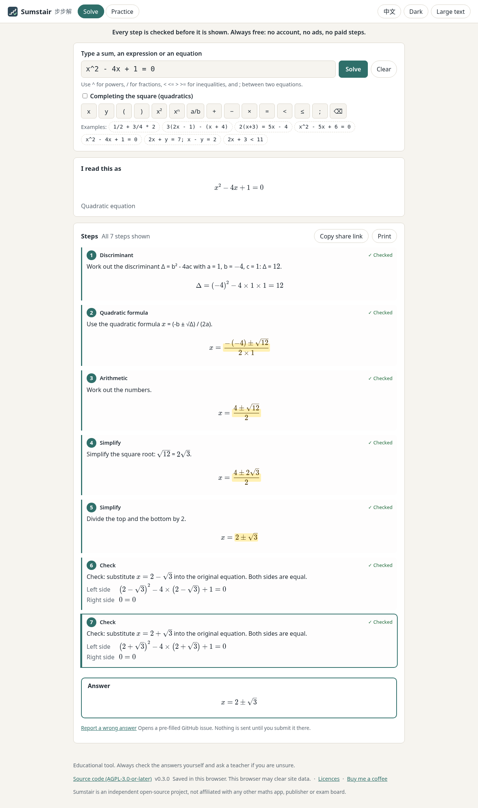

# Sumstair (步步解)

**Sumstair** is a free, open-source, offline **step-by-step maths solver** for
secondary-school algebra. Type a problem and see every step with a short
explanation, in English or Traditional Chinese. **Every step is checked by an
independent exact verifier before it is shown**; a step that cannot be verified
is never displayed. No account, no ads, no tracking, no subscription.



- Try it online (GitHub Pages): <https://kinfxhk.github.io/sumstair/>
- Repository: <https://github.com/Kinfxhk/sumstair>
- Licence: [AGPL-3.0-or-later](LICENSE)
- Support the project: <https://buymeacoffee.com/kinfxhk>

> **Renamed in v0.2.0:** this project was called **StepSlate** until October 2026.
> The English name changed because an unrelated, announced app uses the old name;
> the Chinese name 步步解 is unchanged. Old repository links redirect here; the old
> GitHub Pages address no longer works, so please use the link above.

## Disclaimer

Sumstair is an **educational tool** for learning and for checking your own
work. Each step is machine-verified with exact arithmetic, but software can
still contain bugs: **verify important answers yourself**, and do not use
Sumstair to cheat in tests or exams. It is not a substitute for a teacher.

Sumstair is an independent project and is **not affiliated with, endorsed by,
or sponsored by** any other maths-solver product, company, publisher or exam
board.

## What it solves (v0.3)

| Type                                                  | Examples                                            | How                                                                                                                                                                         |
| ----------------------------------------------------- | --------------------------------------------------- | --------------------------------------------------------------------------------------------------------------------------------------------------------------------------- |
| Arithmetic with fractions, decimals, powers           | `1/2 + 3/4 * 2`, `(2/3)^2 - 0.25`                   | one operation at a time, exact fractions                                                                                                                                    |
| Simplifying polynomials (up to 2 letters, degree ≤ 4) | `3(2x - 1) - (x + 4)`, `(x + 2)^2 - (x - 1)(x + 3)` | expand, remove brackets, collect like terms                                                                                                                                 |
| Linear equations                                      | `2(x + 3) = 5x - 4`, `x/3 + 1 = x/2`                | clear fractions, move terms, divide, check                                                                                                                                  |
| Quadratic equations                                   | `x^2 - 5x + 6 = 0`, `x^2 - 4x + 1 = 0`, `3x^2 = 5`  | factorise when the roots are rational, otherwise the quadratic formula with exact square roots; optional completing the square; "no real roots" when Δ < 0; check each root |
| Two simultaneous linear equations                     | `2x + y = 7; x - y = 2`                             | elimination, back substitution, check; detects no / infinitely many solutions                                                                                               |
| Factorising an expression                             | `factor x^2 - 5x + 6`, `factor x^2 - y^2`           | common factor, difference of squares, perfect square, cross method, grouping; each step is an identity                                                                      |
| Linear inequalities                                   | `2x + 3 < 11`, `-2x <= 4`                           | same moves as a linear equation; dividing by a negative number flips the sign; quadratic inequalities are refused                                                           |

Other features: an **"I read this as"** preview (and a warning for ambiguous
input such as `1/2x`), step-by-step reveal or show all, highlighting of what
changed, a check step that substitutes the answer back into the original
equation, **practice mode** (generated questions, answers accepted in any
equivalent form, step hints, progress kept only in your browser), dark/light
theme, large text, keyboard operation, MathML for screen readers, print styles,
share links (the problem is stored after `#`, which browsers never send to a
server) and **offline use** after the first visit.

Input is forgiving: `×`, `÷`, `−`, full-width characters typed with a Chinese
input method (`２ｘ＋３＝７`) and superscripts (`x²`, `2⁻¹`) are understood, and you
may start with `solve`, `simplify` or `factor` (for example `solve 2x+3=7`). Topics
that are not supported yet (such as `sin`, `log`, `ln` or `abs`) get a clear
"not supported yet" message instead of being misread as letters.

Input limits keep the browser responsive: at most 200 characters, 9-digit
numbers, 6 decimal places; exponents from -20 to 20 in calculations and up to 4
with unknowns.

## How the checking works

The step engine (`packages/core/src/rules`, `solve`) proposes each step. A
separate verifier (`packages/core/src/verify`, which never imports the rules)
must accept it before it is recorded:

- arithmetic: both sides are evaluated with exact rational numbers;
- expressions: polynomial identity, checked exactly on a grid of points large
  enough for the degree;
- equations: the new equation must be a non-zero constant multiple of the old one
  (rearranging, clearing fractions, dividing) **and** have the same solution set,
  found by a direct exact solver (rationals and square roots);
- inequalities: the same solution set (a half-line, every real number, or none)
  **and**, for a rearrangement, a non-zero constant multiple whose sign matches
  whether the inequality sign flipped;
- simultaneous equations: a row-operation matrix with non-zero determinant is
  attached to each step and checked coefficient by coefficient, plus the solution
  set;
- check steps: the substitution and every displayed value are recomputed.

If the verifier rejects a step, Sumstair stops and says so instead of showing
it. Property-based tests (fast-check) and mutation tests (deliberately broken
steps must be rejected) cover the engine. `npm run oracle` checks the same steps
again with sympy, which does not share the engine's code.

## Use it

- **Online:** <https://kinfxhk.github.io/sumstair/> (works offline after the first
  visit).
- **Offline / self-hosted:** download `sumstair-site-v0.3.0.zip` from the
  release, unzip, and serve the folder with any static server on localhost.
- **Docker:**

  ```sh
  docker build -t sumstair .
  docker run --rm -p 127.0.0.1:4873:4873 sumstair
  # open http://127.0.0.1:4873/
  ```

- **From source** (Node.js 22 or later):

  ```sh
  git clone https://github.com/Kinfxhk/sumstair.git
  cd sumstair
  npm ci
  npm start            # builds and serves on http://127.0.0.1:4873/
  npm run solve -- "x^2-5x+6=0"            # plain-text steps in the terminal
  npm run solve -- --lang zh-HK "2x+3=7"
  ```

## Privacy

The app makes **no network requests** of its own: no analytics, fonts or CDNs
(enforced by a Content-Security-Policy of `default-src 'self'` and by tests).
Settings and practice progress are stored only in your browser's localStorage;
practice mode has a button to clear progress. If you use the GitHub Pages copy,
GitHub hosts the files and may keep its own access logs; self-host or use the
offline zip to avoid that.

## Development

```sh
npm ci
npm run dev          # Vite dev server on http://127.0.0.1:4874/
npm run check        # lint, format, typecheck, unit/property/golden tests,
                     # licence allowlist, repository hygiene, secret scan (gitleaks)
PW_CHROMIUM_PATH=/usr/bin/google-chrome npm run test:e2e   # browser tests
npm run package:site # release/sumstair-site-v<version>.zip
```

Layout: `packages/core` (exact numbers, parser, step rules, verifier, practice
generators; zero runtime dependencies), `packages/web` (Vite + TypeScript UI,
KaTeX), `packages/cli` (terminal solver and a loopback static server).

Contributions are welcome under the rules in [CONTRIBUTING.md](CONTRIBUTING.md):
clean-room work only (no code, text or screenshots from other solvers), every
new rule must pass the verifier, and commits are signed off (DCO). Found a wrong
step or answer? Use the **Report a wrong answer** link under the steps (it opens a
pre-filled GitHub issue that you check and send yourself; nothing is sent
automatically) or open an issue. Everyone taking part follows the
[Code of Conduct](CODE_OF_CONDUCT.md).

**How it is made:** Sumstair is written with AI coding agents working under the
maintainer's direction. That is why the project leans so hard on machine
checking: an independent verifier must accept every step, and golden, property
and mutation tests, a licence allowlist, a hygiene check and a secret scan run on
every change. Contributors may use AI tools too, under the
[AI-assisted development policy](CONTRIBUTING.md#ai-assisted-development):
review every line, never reproduce other solvers' code or text, take DCO
responsibility, and disclose AI use in the pull request.

## Commitments

Sumstair will **never** have:

- **ads**;
- **tracking or analytics** of any kind, not even "anonymous";
- **paid unlocking of steps**, subscriptions, daily limits or accounts.

Every step stays free for everyone. The code stays open source under
AGPL-3.0-or-later, so nobody can turn it into a closed paid service without
sharing their changes. Donations are optional and change nothing in the app.

## Licence

Sumstair is free software: you can redistribute it and/or modify it under the
terms of the GNU Affero General Public License, version 3 or (at your option)
any later version. If you run a modified version for other people over a
network, you must offer them its source code (the footer "Source code" link
does this for the original). Third-party components are listed in
[THIRD_PARTY_NOTICES.md](THIRD_PARTY_NOTICES.md) (KaTeX, MIT).

---

## 繁體中文

**步步解（Sumstair）** 是一個免費、開源、可離線使用的**數學逐步解題器**，適用於中學代數。
輸入題目，即可看到每一步及簡短解釋（繁體中文或英文）。
**每一步在顯示前都會經獨立的精確驗證器檢查**；未能驗證的步驟一律不會顯示。
毋須帳戶，沒有廣告、追蹤或訂閱。

> **v0.2.0 起改名：** 本項目的英文名稱在 2026 年 10 月前為 **StepSlate**。由於有一個無關、已公佈的
> app 使用舊名，故更改英文名稱；中文名稱「步步解」不變。舊 repo 連結會自動轉到這裏，但舊的
> GitHub Pages 網址已不能使用，請改用上面的新網址。

### 免責聲明

步步解屬**教育用途**工具，用於學習及核對自己的答案。每一步雖經精確運算自動驗證，
但軟件仍可能有錯漏：**重要答案請自行核對**，亦請勿用於測驗或考試作弊。本工具不能取代老師。

步步解是獨立項目，與任何其他解題產品、公司、出版社或考評機構**均無關連**，
亦未獲其認可或贊助（not affiliated）。

### 功能（v0.3）

- 四則運算（分數、小數、指數）、化簡多項式（最多兩個字母、最高四次）、因式分解、
  一元一次方程、一元一次不等式（除以負數時不等號反轉；二次不等式會拒絕，不會亂猜）、
  一元二次方程（有理根時因式分解，否則用二次公式並以根式精確表示；可改用配方法；Δ < 0 時無實根）、
  二元一次聯立方程（消元法，再代入驗算；可判斷無解或無限多解）。
- 輸入寬鬆：接受 `×`、`÷`、`−`、中文輸入法的全形字元（例如 `２ｘ＋３＝７`）及上標（`x²`、`2⁻¹`），
  亦可在題目前加 `solve`、`simplify` 或 `factor`。未支援的課題（例如 `sin`、`log`、`ln`、`abs`）
  會清楚說明「暫時未支援」，不會誤當作字母。計算時指數可為 -20 至 20，含未知數時最高 4 次。
- 「我理解為」預覽（遇到 `1/2x` 一類有歧義的寫法會提示）、逐步顯示或顯示全部、
  高亮變動部分、方程題最後一步把答案代回原式驗算。
- 練習模式：程式生成題目，接受任何等價寫法（例如 `0.5` 與 `1/2`），可逐步提示；
  進度只儲存在瀏覽器，可一鍵清除。
- 深淺色、大字、鍵盤操作、供讀屏軟件使用的 MathML、列印樣式、網址分享
  （題目放在 `#` 之後，不會傳送到伺服器）、首次載入後可離線使用。
  頁面會嘗試要求瀏覽器保留本機資料，並顯示結果；練習幾題後可下載 JSON 備份，亦可關閉提示。
  備份只在這部裝置產生，不會上傳。

### 使用方法

- 網上版：<https://kinfxhk.github.io/sumstair/>（首次載入後可離線使用）。
- 自架／離線：下載 release 中的 `sumstair-site-v0.3.0.zip`，解壓後以任何靜態伺服器在本機提供。
- Docker：`docker build -t sumstair .`，再 `docker run --rm -p 127.0.0.1:4873:4873 sumstair`。
- 原始碼（Node.js 22 或以上）：`npm ci`，然後 `npm start`，開啟 <http://127.0.0.1:4873/>。

### 私隱

程式本身不會發出任何網絡請求（沒有分析工具、外部字型或 CDN，並以 CSP `default-src 'self'`
及自動測試強制）。設定及練習進度只儲存在瀏覽器的 localStorage。
若使用 GitHub Pages 版本，檔案由 GitHub 託管，GitHub 或會保留其存取紀錄；
如不希望這樣，可自架或使用離線壓縮檔。

### 承諾

步步解**永遠不會**加入：

- **廣告**；
- 任何形式的**追蹤或分析工具**（即使聲稱「匿名」也不會）；
- **付費解鎖步驟**、訂閱、每日次數限制或帳戶。

每一步都永遠免費。程式碼以 AGPL-3.0-or-later 開源，任何人都不能把它改成封閉的收費服務而不公開修改。
捐款純屬自願，不會改變程式任何功能。

### 開發方式及參與

步步解由 AI 編程助手在維護者指示下撰寫。正因如此，項目非常依賴機器檢查：每一步都要經獨立驗證器接受，
每次修改都要通過標準答案測試、性質測試、變異測試、授權白名單、項目規範檢查及密鑰掃描。
歡迎貢獻，但須遵守 [CONTRIBUTING.md](CONTRIBUTING.md)：只可自行撰寫（不可抄襲其他解題器的程式碼、文字或截圖），
如使用 AI 工具，必須逐行審閱、不可要求 AI 重現其他解題器的程式碼或文字、為整份貢獻負 DCO 責任，並在
pull request 註明曾使用 AI。發現步驟或答案有錯？可按步驟下方的「回報錯誤答案」，會開啟一個預先填好的
GitHub issue，由你自己檢查後提交（不會自動傳送任何資料）。

### 授權

本軟件以 GNU Affero 通用公共授權條款第 3 版或（由你選擇）任何較新版本發佈
（AGPL-3.0-or-later）。如你修改後透過網絡提供予他人使用，須向使用者提供相應原始碼。
第三方元件見 [THIRD_PARTY_NOTICES.md](THIRD_PARTY_NOTICES.md)。

- 網上版（GitHub Pages）：<https://kinfxhk.github.io/sumstair/>
- 原始碼：<https://github.com/Kinfxhk/sumstair>
- 支持項目：<https://buymeacoffee.com/kinfxhk>
